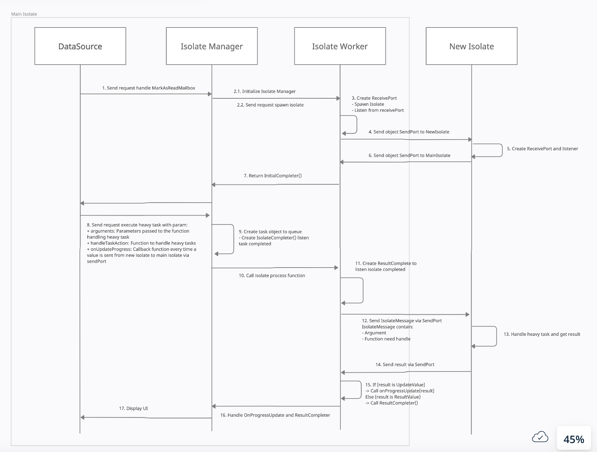

# 8. Handle heavy task with isolate

Date: 2022-06-29

## Status

Accepted

## Context

- Use isolate to handle heavy task

## Decision

- Initialize the IsolateManager to help manage the list of tasks and isolate
```
final isolateManager = IsolateManager();
await isolateManager.initialize(isolatesCount: 1);
```
 + `isolatesCount`: The number of isolates created and run concurrently. Depends on your device's processor.

- Perform task processing by calling `execute` function
```
isolateManager.execute(
    arguments,
    handleTaskAction,
    onUpdateProgress
);
```
 + `arguments`: Parameters passed to the function handling heavy tasks.
 + `handleTaskAction`: Function to handle heavy tasks
 + `onUpdateProgress`: Callback function every time a value is sent from `new isolate` to `main isolate` via `sendPort`

- The return value is a `Completer`

- Communicate between two isolates
To see a visual representation of this process, take a look at the image below:



## Consequences

- No UI block when handling long-term tasks.
- Increase application performance, smoother application.

## Reference

- 
