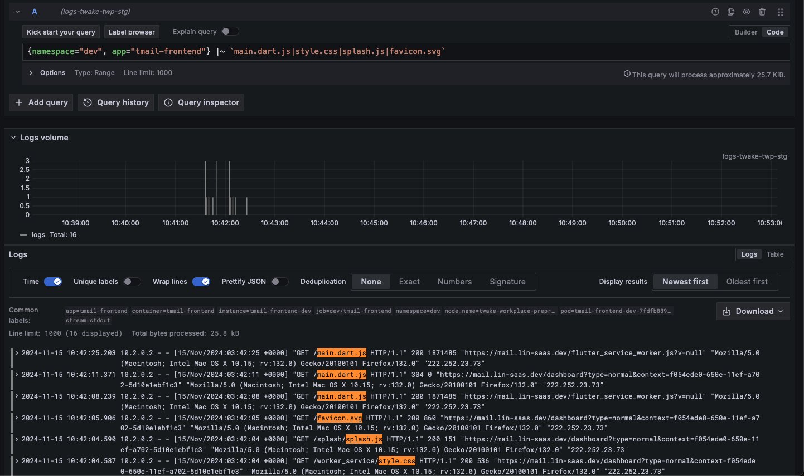
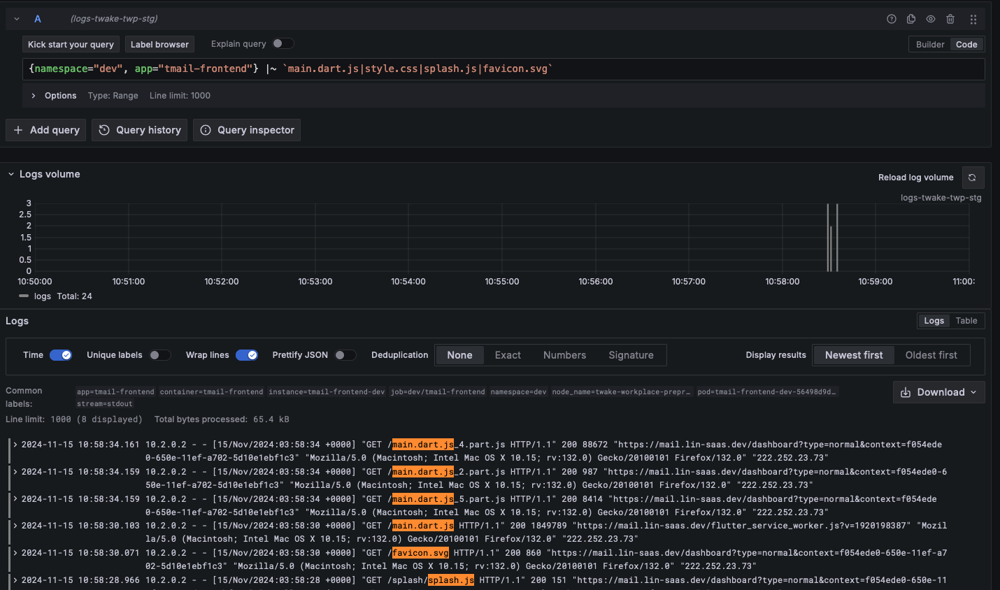

# 56. Update Flutter Service Worker Initialization

Date: 2024-11-15

## Status

Accepted

## Context

- Since the new version of Flutter, old initialization of Flutter Service Worker does not work.
  - Version is always null
  - Twake Mail web resources is requested everytime the web is loaded, no cache is used 
    - One hard-reload, one normal reload

## Decision

- We update the initialization of Flutter Service Worker according to the new version of Flutter
- More reference: https://docs.flutter.dev/platform-integration/web/initialization

## Consequences

- Twake Mail web use cache resources to improve performance 
  - One hard-reload, many normal reload
