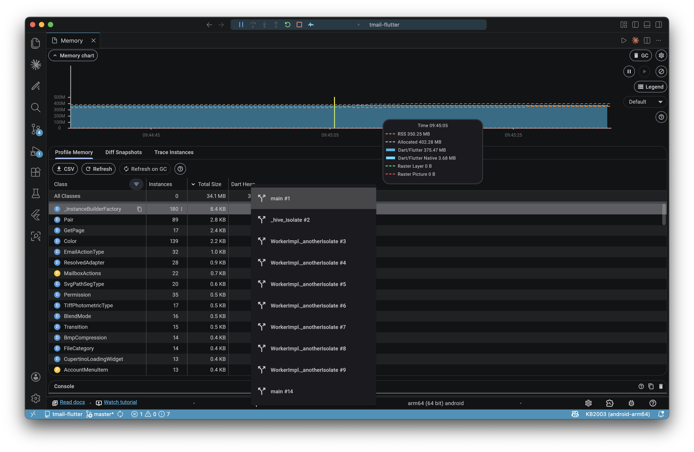
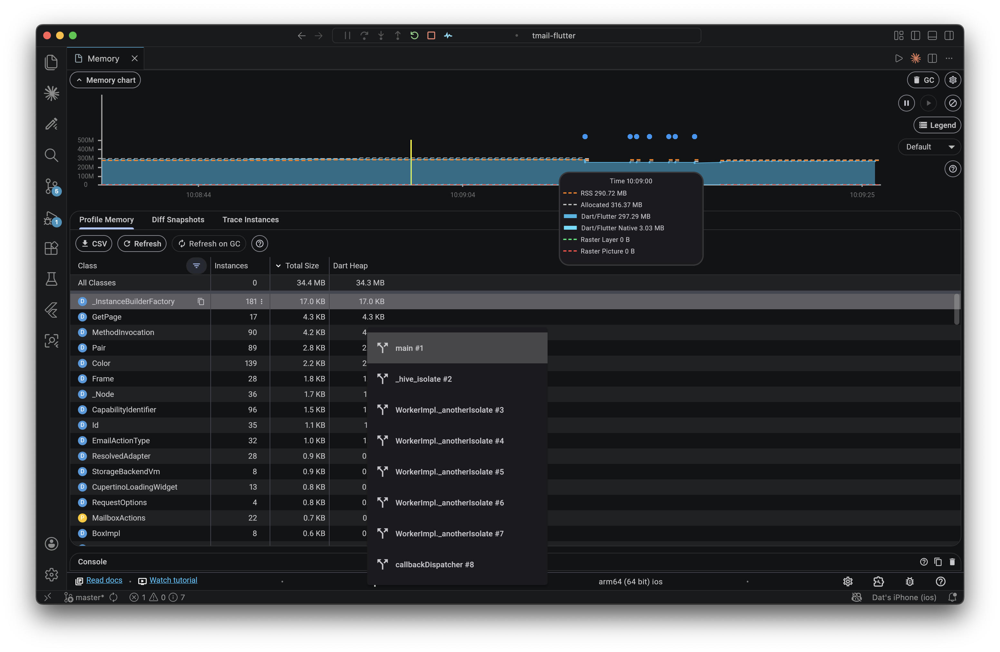
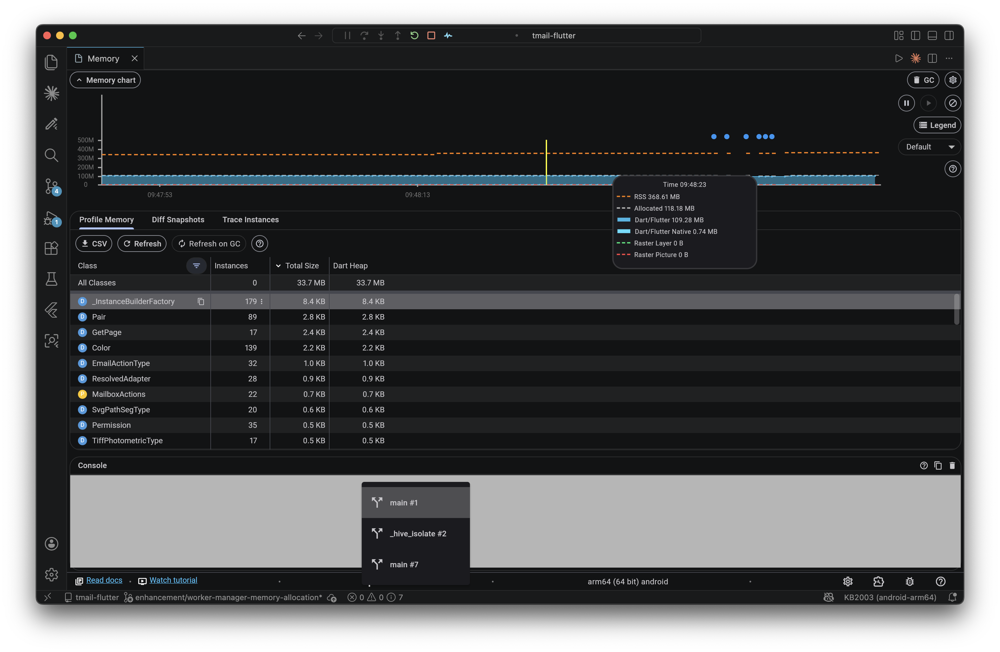
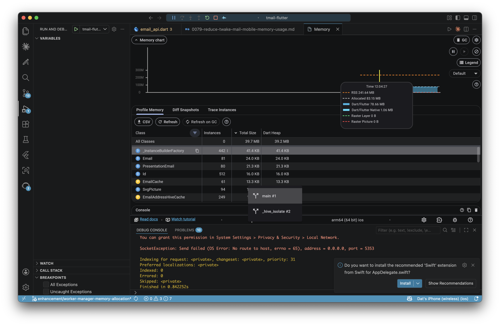
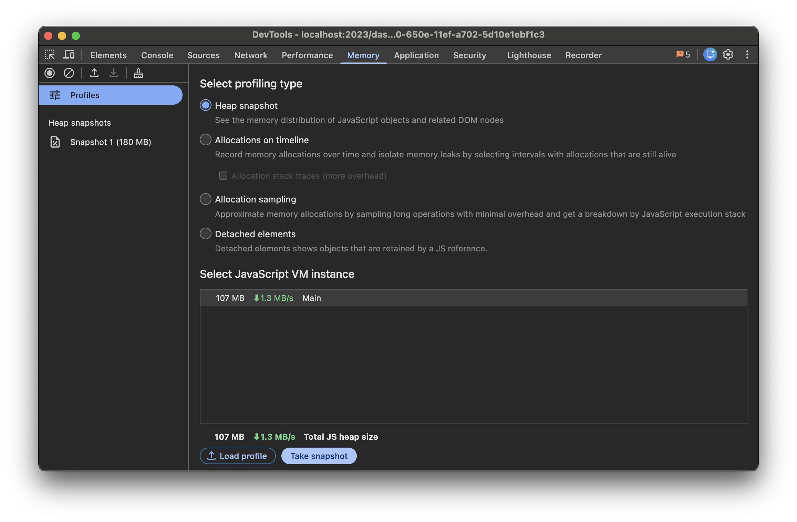
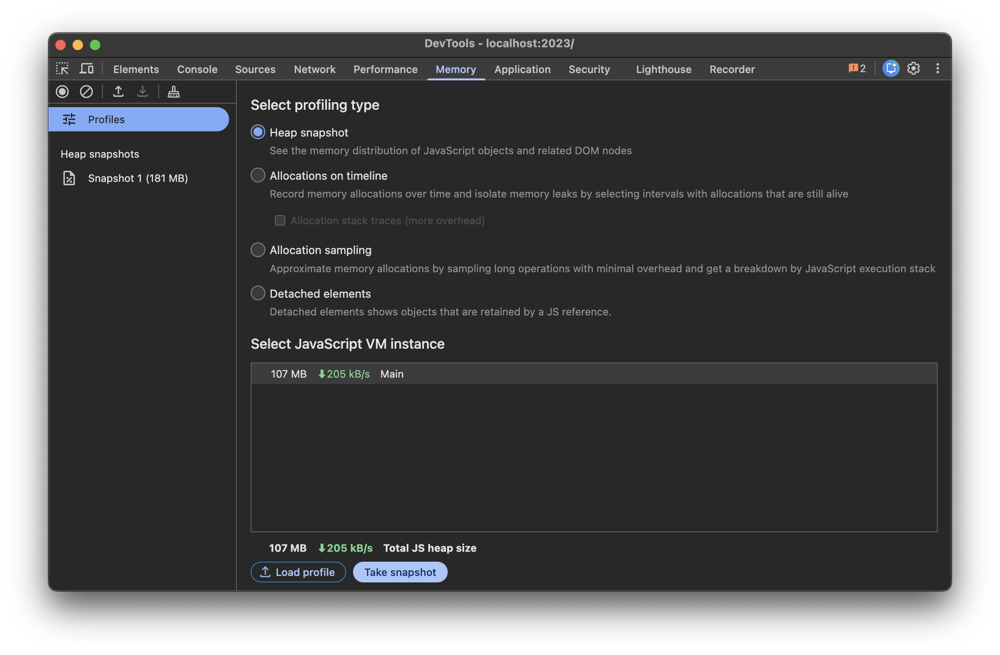

# 0079 - Reduce Twake Mail mobile memory usage

Date: 2026-04-09

## Status

Accepted

## Context

Twake Mail is allocating a lot of memory on mobile.
- ~375 MB on Android (Oneplus 8T)

- ~297 MB on iOS (iPhone 11 Pro)

## Findings

### `worker_manager` library's inefficient memory allocation (Android & iOS)
- Version `5.0.3` counts the number of processors (x) on the device, create forever-live x - 1 isolates
- Version `7.2.7` adds an ability to create isolate on-demand, and dispose when done. However, it still leaks 1 isolate when init.
### `firebase_messaging` library's eager background Dart isolate (Android)
- FirebaseMessaging.onBackgroundMessage() creates a forever-live isolate even when the app is in foreground.
- Related: https://github.com/firebase/flutterfire/issues/17163
### Unused `flutter_downloader` library's worker (iOS)
- The only usage was deleted in https://github.com/linagora/tmail-flutter/commit/be8eaf625818b17e60ca65846053cb8c26a71a15#diff-451741ba5146e6ad711c77e4c2fe34958a36595e4926cd43c2ddb97586ef6d88, but the library and initialization process remained, causing 1 forever-live isolate.

## Decision

### `worker_manager`
- Upgrade to `7.2.7`
- Create an upstream fix for init's isolate leak
### `firebase_messaging`
- Wait for https://github.com/firebase/flutterfire/pull/18122, update when merged
### `flutter_downloader`
- Remove the library

## Consequences

- Android: ~118 MB

- iOS: ~78 MB

- No changes for web

| Before | After |
| :--- | :--- |
|  |  |