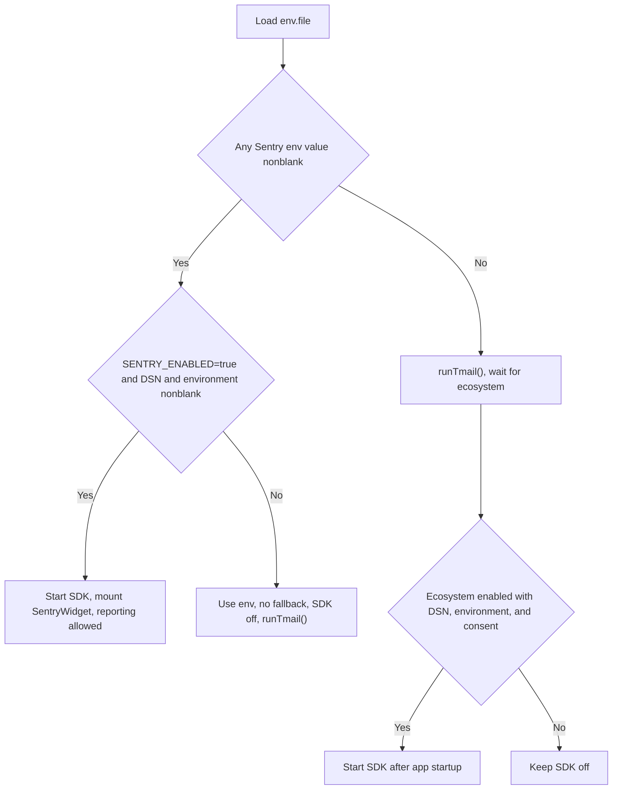
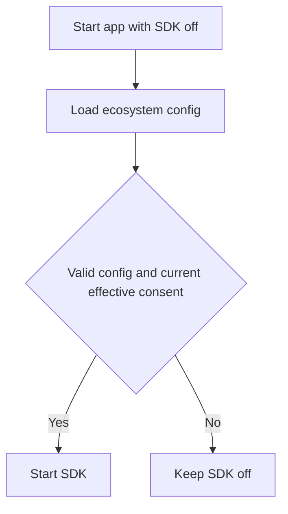
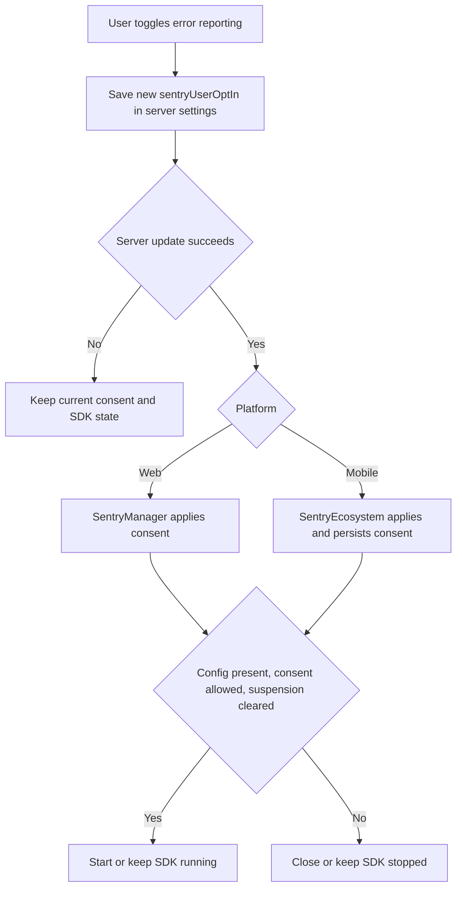

# 0109 - Control Sentry SDK Lifecycle with Reporting Consent

Date: 2026-09-16

## Status

Accepted

Web startup behavior is amended by [ADR-0110](0110-web-sentry-ecosystem-fallback-and-denied-default.md).

## Context

Reporting consent can change at runtime, while native crashes, hangs, ANRs, and sessions bypass Dart capture gates. Permanently disabling native integrations would block telemetry after opt-in.

## Decision

Sentry starts only with valid technical configuration and effective consent, and closes with `Sentry.close()` when denied or suspended. Mobile starts denied, while web starts allowed only with `SENTRY_ENABLED=true` and nonblank `SENTRY_DSN` and `SENTRY_ENVIRONMENT` in `env.file`.
Lifecycle transitions are serialized, initialization that finishes after revocation closes, and reinitialization never reruns the Flutter `appRunner`. Runtime capture gates and `beforeSend` callbacks remain active during transitions.

### Platform flows

#### Web

Any nonblank `SENTRY_ENABLED`, `SENTRY_DSN`, or `SENTRY_ENVIRONMENT` selects `env.file`, while ecosystem fallback requires all three values to be absent or blank.

Disabled or incomplete env configuration installs no Sentry runtime configuration, so the reporting preference stays hidden. End-to-end tests also call `runTmail()` directly.

#### Mobile

After ecosystem loading, effective consent is `server sentryUserOptIn ?? ecosystem userOptInByDefault ?? false` on both platforms. A later server value overrides the ecosystem default. Ecosystem loading or unavailability suspends reporting, and an account change clears previous consent before the next account can report.

#### Reporting toggle in user settings

The toggle appears with server settings and a usable Sentry runtime configuration. It saves `true` when turned on and `false` when turned off, then applies the returned value only after server acknowledgment.

Web keeps the widget path chosen at startup. Mobile caches consent for background FCM, and iOS also updates the notification extension through Keychain.

Session Replay remains disabled because Sentry Flutter 9.8.0 cannot discard its buffer after revocation. Background FCM and the iOS extension treat missing, invalid, or unreadable persisted consent as denied, and timed-out setup cannot enable Sentry later. The extension also blocks reporting when its shared DSN or environment differs from the active SDK. If cache cleanup fails, the app attempts to publish a denied extension configuration and rethrows the cleanup error when publication succeeds. Keychain write failures reach the caller.

## Consequences

Valid configuration and consent permit Dart and platform telemetry, while denied consent stops the SDK. Resuming requires reinitialization, and events while stopped cannot be recovered.

### Trade-offs

- Valid web env configuration can report startup events, while ecosystem fallback waits for configuration and consent.
- An ecosystem default can apply before server consent loads, and a later server value may stop the SDK.
- Web ecosystem fallback lacks `SentryWidget` interaction breadcrumbs and tracing, while automatic screenshots are disabled in both web paths.
