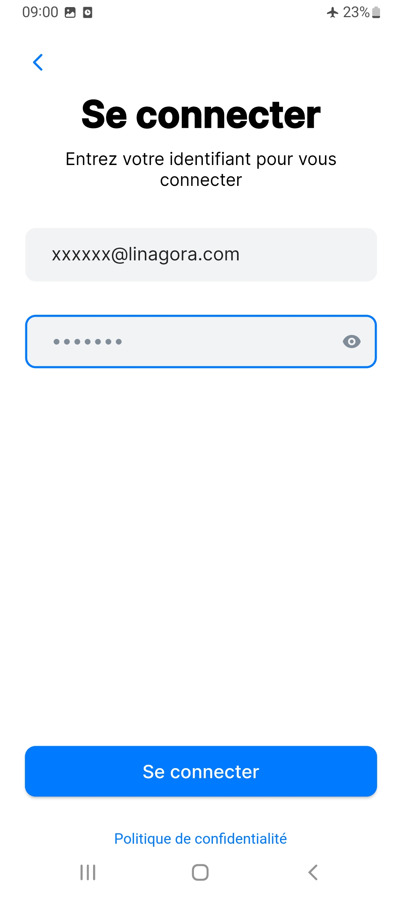

# Authenticating in Team-Mail

Team-mail supports both being integrated with an identity provider and basic authentication/

## Web: Login with OIDC

Upon being launched Team-Mail detects that your installation supports identification through an indentity provider and redirects to its login page.

Fill in your credentials spplied by your plateform administrator, and the identity provider will redirect you to the mail Team-Mail page.

## Web: Login with basic authentication

If Team-Mail finds no identity provider, Tmail will fallback to basic authentication and ask for your login and password.

TODO: add a basic auth screen

## Mobile

For mobile you need to connect to your home JMAP email server. Tmail will prompt you for its URL first. Your administrator should have provided you this value.

Then Team mail would either redirect you to the auto-detected identity server or ask you directly for your credentials.

