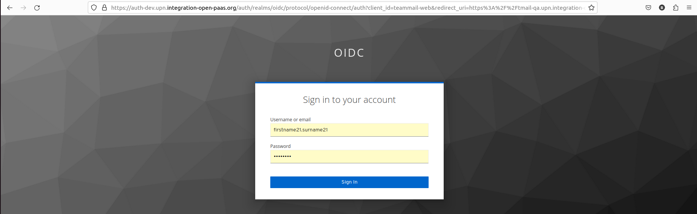

# Authenticating in Team-Mail {#auth}

Team-mail supports both being integrated with an identity provider and basic authentication/

## Web: Login with OIDC

Upon being launched Team-Mail detects that your installation supports identification through an indentity provider and redirects to its login page.

Fill in your credentials supplied by your plateform administrator, and the identity provider will redirect you to the mail Team-Mail page.

## Web: Login with basic authentication

If Team-Mail finds no identity provider, Tmail will fallback to basic authentication and ask for your login and password. Fill in your credentials then click Sign in. 
If the credentials are correct, you will be logged- in successfullly and go to Inbox thread-view. 

## Mobile

For mobile, you need to input your email address first. From this email address, TMail will auto-dectect identity server if your account are supported with identification through an indentity provider  You just need to input password to login:

If Tmail detects that  your account are not supported with identification through an indentity provider,  you need to connect to your home JMAP email server. Tmail will prompt you for its URL first. Your administrator should have provided you this value.

Then Team mail will ask you directly for your credentials to log-in 

