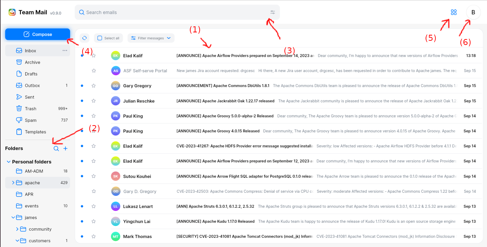
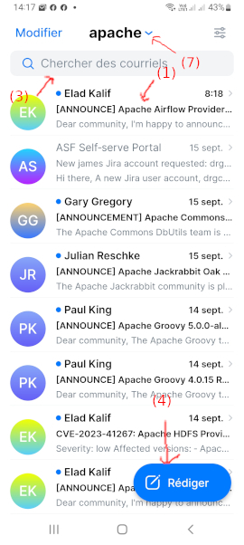
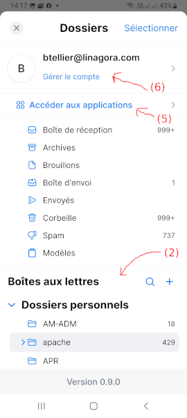

# Team-Mail user guide

This guide intends to present features present in Team-Mail and how to use them.

It aims at helping users discover the user experience and advanced productivity features present in Team-Mail.

This guide provides information both for mobile and weg

## Features covered

 - [Installing the application](#install)
 - [Authentication](#auth)
 - [Reading and acting on emails](#read.)
 - [Writing emails](#composer)
 - [Using folders to sort emails](#folder)
 - [Quota](#quota)
 - [Searching your emails](#search)
 - [Managing your account](#profile)
 - [Anti-spam](#1)
 - [Extra features](#2)
 - [Security](#security)

We also have a page for advanced users looking for [productivity tips](#tips).

## Main 

Once [logged in](#auth) into Team-mail, Team-Mail redirects you to your INBOX (1). This is where you can [read your newly arrived emails](#read).

The left panel (2) allows you to switch of folder (view emails within another folder), and [manage your folders](#folder). 
The left pannel also displays [quota](#quota) information might you need to.

The search bar (3) at the top allows to [easily and quickly search your mails](#search). Many criteria are also supported within the advanced search might you need to.

This button opens the [composer](#composer) (4), which allows to write new emails to your friends and colleagues.

This button opens the list of applications integrated with Team-Mail for your current setup (5).

This button allows you to open your [profile page](#profile) (6). From there you can:
 - Manage your senders identities and signatures
 - Set up email rules to automatically sort your mails
 - Set up forwards to a third party email service
 - Enable your vacation mode
 - Manage folder visibility
 - And change your language settings.
 - This menu also enables you to log out from tmail.

The same sections are also available on mobile. The default view is your INBOX but by clicking the folder name (7),
you can open the folder tab that allows you to access other menus.

