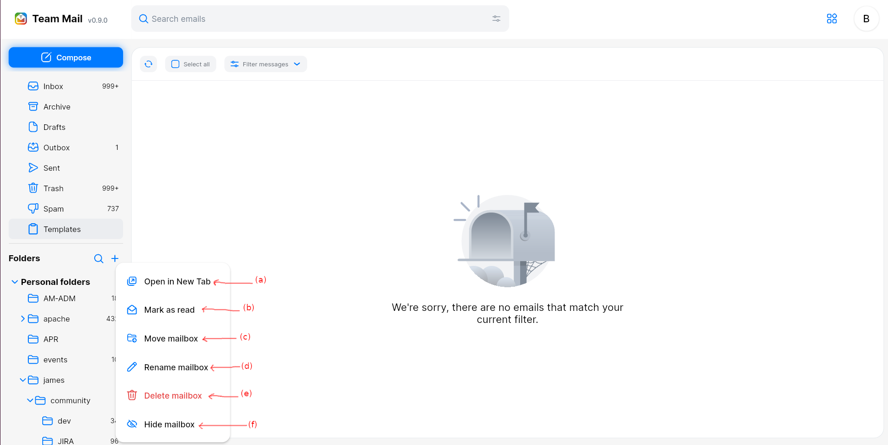

# Manage folders - Web {#folder}

The left panel of the main view displays folders of this account.

Folders offers a way to sort and arrange your emails. By clicking on a folder you can see the emails contained in it. A given mail
can only be in one folder.

(1) Next to each folder is displayed the mailbox counter: how many emails are unseen in this folder.

(2) At the top are displayed mailbox system folders with special roles, this includes:

 - `INBOX`: this is where the new emails arrives by default.
 - `Archive`: this is the base folder for your archives: archiving actions moves emails to the right sub-folder based on the sending date. Note that archiving action is not currently implemented.
 - `Drafts`: this mailbox lists drafts, emails that had been saved while writing them in the composer. Clicking on an email in this mailbox
will open it in the composer. Drafts are removed once sent.
 - `Outbox`: this mailbox displays emails that you sent and are currently processed. Once fully sent they are moved to the `Sent` mailbox
 - `Spam`: this mailbox is where messages detected as spam arrives. Read more about [spam handling in Team_mail](anti-spam.md)
 - `Templates`: This mailbox holds your templates. Templates can be re-opened as new mails in the composer, and simplifies the task of frequently sending similar emails. Note that templates special
actions is not currently implemented.

Personnal folders section list folders you did create. They are alphabetically ordered. Note that they are displayed as a tree: subfolders are attached to their parent folders, and tree entries can
be folded, unfolded based on your needs.

(3) One can create extra folders if needed. This will open the `create folder` dialog, letting you select a base folder (defaults to `All mailboxes`) and choose a mailbox name.

(4) Let's you find folders by name. This is convenient when you have numerous folders. Note that folder search display both visible and hidden folders.

Users can perform the following actions on folders:

Those actions includes:

 - (a) Open this folders into a new Tab. 
 - (b) Mark all the emails in this folder as read. This will schedule a task marking you emails as read, eventually decreasing the mailbox counters to 0.
 - (c) Move folder allows you to select a new parent folder for a given mailbox.
 - (d) Rename a mailbox let you specify a new name for this mailbox.
 - (e) Delete mailbox
 - (f) Hidde mailbox removes the folder from the folder list without deleting it. You may show this folder again by setting it as visible in the folder visibility tab of your [profile](profile.md).

# Mobile

After log-in to TeamMail app, you can see default folder is INBOX. When you click on folder name, You can see your folder list 

(1) Next to each folder is displayed the mailbox counter: how many emails are unseen in this folder.

(2) At the top are displayed mailbox system folders, this includes: INBOX, Archive, Drafts, Outbox, Spam, Templates

Personnal folders section list folders you did create. They are alphabetically ordered. Note that they are displayed as a tree: subfolders are attached to their parent folders, and tree entries can
be folded, unfolded based on your needs.

(3) One can create extra folders if needed. This will open the create folder dialog, letting you select a base folder (defaults to All mailboxes) and choose a folder name.

(4) Let's you find folders by name. This is convenient when you have numerous folders. Note that folder search display both visible and hidden folders.

Users can perform the following actions on folders:

Those actions includes:

 - (a) Mark all the emails in this folder as read. This will schedule a task marking you emails as read, eventually decreasing the mailbox counters to 0.
 - (b) Empty Trash/Spam: This action will permanently delete all items in Trash/Spam
 - (c) Move folder allows you to select a new parent folder for a given mailbox.
 - (d) Rename a folder let you specify a new name for this mailbox.
 - (e) Delete folder
 - (f) Hide folder removes the folder from the folder list without deleting it. You may show this folder again by setting it as visible in the folder visibility tab of your [profile](profile.md).

On mobile, you can long- press on a folder to see the possible actions for that folder, or you can click button Select on top right then select the folder you want, then the possible actions will be appears at the bottom of screen 

