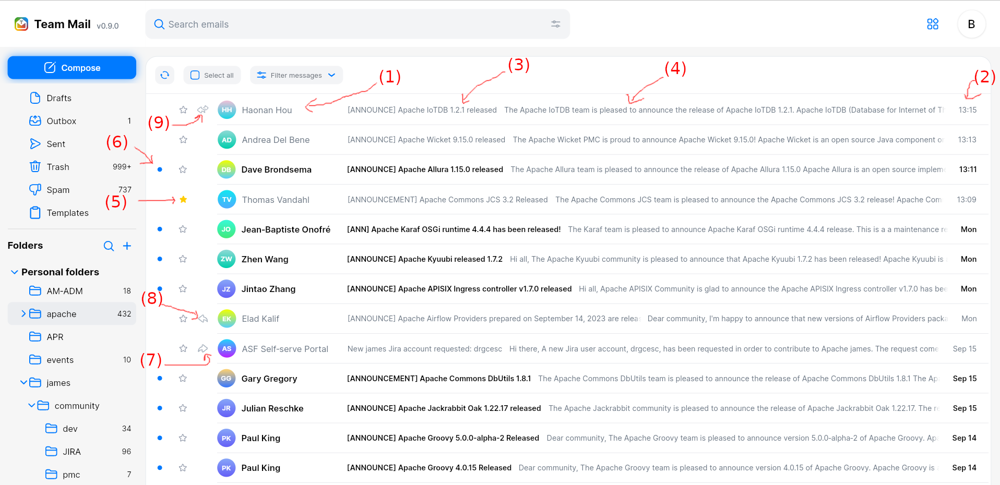
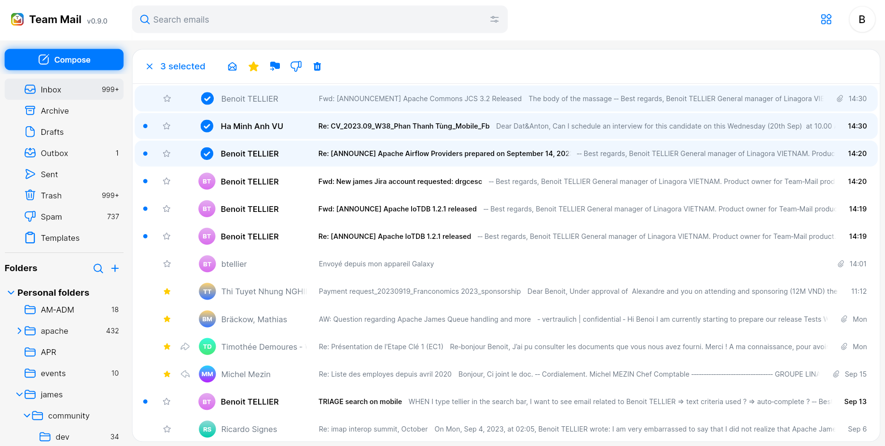
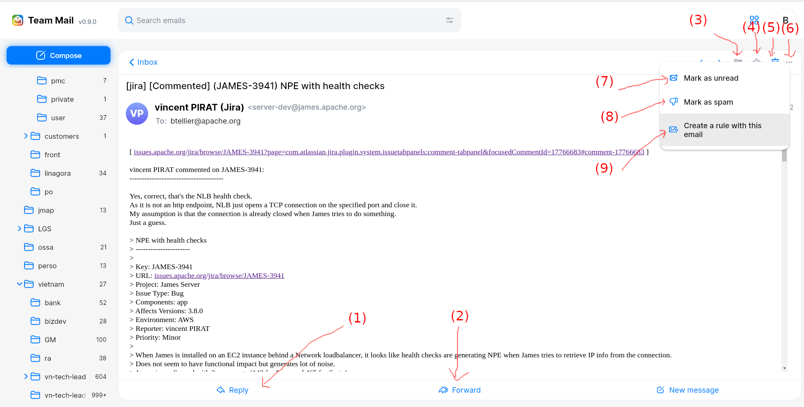

# Reading emails

This page explains how to read your emails and explains which actions can be performed on your emails.

The right panels allows one to read his email. It shows emails within a folder, organized by time.

Here are the information added to each mails in the mailbox listing:

 - (1) `From`: the identity (firstname, lastname and mail address) of the sender of the email.
 - (2) The `date` at which the email was sent
 - (3) The `subject` of the email
 - (4) If the email has `attachments` then the attachment icom will be displayed
 - (5) If the email is `starred`
 - (6) If the email is read or not
 - (7) If the email forwarded
 - (8) If you answered to this mail
 - (9) If you both answered and forwarded the mail

Note the button to reload and look for new emails on the server.

TODO mobile

## Open en email

You can open emails by clicking on them:

Here are the information you can see when opening an email:

 - (1) `From`: the identity (firstname, lastname and mail address) of the sender of the email.
 - (2) `To`: the identities of the people this email is written to.
 - (3) `Cc`: the identities of the people in copy of this email
 - (4) The `date` at which the email was sent
 - (5) The `folder` in which the email is located
 - (6) The `subject` of the email
 - (7) The `attachments` of the email. You can download them by clicking them.
 - (8) The body of the email, containing its main message.
 - (9) If the email is `starred`

(10) Long emails might require you to scroll in order to read them fully.

(11) Note the navigation arrows allowing to come back to mailbox email list. You can also choose to go directly to next or previous email.

TODO mobile

## Email actions

When reading emails, a user can perform some actions on it.

Quick actions are available in one click and are shown when putting the mouse on an email item:

Available actions includes:

 - (1) Open this message in a new tab (instead than on the current one)
 - (2) Mark as read / mark as unread
 - (3) Move this message into another folder. It opens a dialog window to let you choose the target folder.
Note that on web this action can be performed via a drag and drop: take the email and drop it into the target mailbox.
 - (4) Move this email to the tash. Same as (3) but you do not have to select the target folder. Note that emails can only be deleted in the Trash (this action is then replaced by "Delete Permanently"
in this mailbox).
 - (5) Extra actions are also available: Open this email in a new tab and report this email as Spam (which moves this email into the Spam mailbox. THis email will eventually be reported as Spam to
our anti-spam).
 - (6) Mark this message as `starred`

One can select email by clicking on the sender icon:

Actions on selected emails are applied on all selected mails and include:

 - (1) Mark as read / mark as unread
 - (2) Mark this message as `starred`
 - (3) Move this message into another folder. Note that on web this action can be performed via a drag and drop: take the email and drop it into the target mailbox.
 - (4) Report this email as Spam (which moves this email into the Spam mailbox. THis email will eventually be reported as Spam to our anti-spam).
 - (5) Move this email to the tash. Same as (3) but you do not have to select the target folder. Note that emails can only be deleted in the Trash (this action is then replaced by "Delete Permanently"
in this mailbox).

Actions can also be performed on opened emails:

Actions on opened email include:

 - (1) Reply to this mail. It opens a composer, adds `Re:` prefix before the topics, set the sender of the previous email as a `To` recipients and quotes the previous email.
 - (2) Forward this mail. It opens a composer, adds `Fwd:` prefix before the topics, quotes the previous email, and let you sepcify the recipients you want.
 - (3) Move this message into another folder. It opens a dialog window to let you choose the target folder.
 - (4) Mark this message as `starred`
 - (5) Move this email to the tash. Same as (3) but you do not have to select the target folder. Note that emails can only be deleted in the Trash (this action is then replaced by "Delete Permanently"
in this mailbox).
 - (6) Extra actions are also available. They are detailed below.
 - (7) Mark as read / mark as unread
 - (8) Report this email as Spam (which moves this email into the Spam mailbox. This email will eventually be reported as Spam to our anti-spam).
 - (9) Create an [email rule](profile.md#email-rule) for this email. Email rules allow to declare criteria upon which matching emails would be moved to a folder.

TODO mobile
