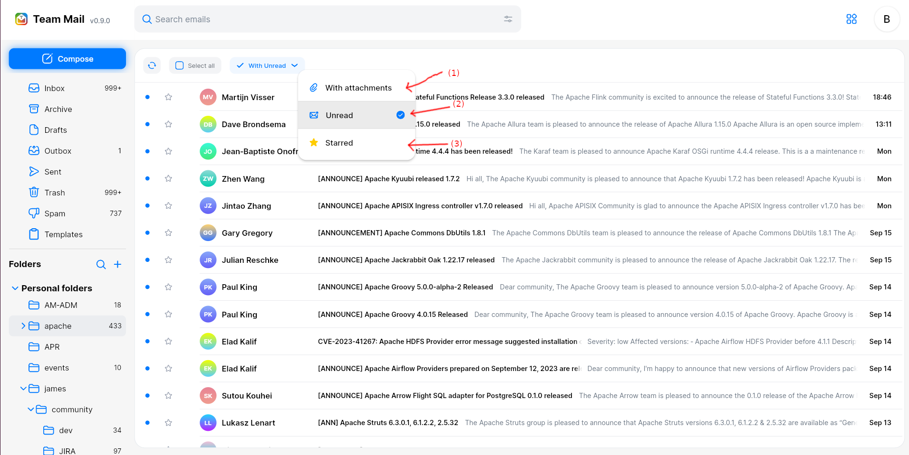

# Search {#search}

**On Web**

TMail offers you several tools to quickly find your emails.

## Quick search

The top search bar allows you to quickly look for your emails. Just start typing text in it, and top search results will appear interactively.

Additional filters are also added for convenience. Those include:

 - (1) `Has attachment`: If checked, then only emails with attachments will be returned.
 - (2) `Last 7 days`: If checked, then only returns emails sent within the last 7 days.
 - (3) `From me`: Only includes emails that you sent.

(4) allows to clear your input.

(5) allows to enter the advanced search.

## Advanced search

The top search bar button on the left opens the advanced search, allowing you to specify more criteria.

Those criteria includes:

 - (1) `From`: Specifying who should have sent the emails returned. This field supports auto-complete on your contacts.
 - (2) `To`: Specifying who the emails returned should be addressed to. This field supports auto-complete on your contacts.
 - (3) `Subject`: Allow specifying words that should appear in the subject of returned emails.
 - (4) `Has the word`: Specifies the word that should appear anywhere in the returned email.
 - (5) `Doesn't have`: Specifies the word that should not appear anywhere in the returned email.
 - (6) `Folder`: Specifies in which folder the returned emails should be placed.
 - (7) `Date`: Specifies a time range in which the returned emails should have been sent.
 - (8) `Has attachment`: If checked, then only emails with attachments will be returned.

Clicking the (9) search button will launch the search and display all corresponding emails. `Clear filer` (10) will reset your input.

## Folder filters

From the folder display you can easily apply filters to the current folder.

Filters includes:

 - (1) All emails in this folder with attachments
 - (2) All emails in this folder that are not read
 - (3) All emails in this folder that are starred

**On Mobile**

On mobile, When you click on Search bar, start typing text in it, and top search results will appear interactively.

 Under the search bar, there are some tags that allow you to specify more criteria. Those criteria include:

 - (1) `From`: Specifying who should have sent the emails returned. When you click on this tags, a new screen will be opened that allow you to input email address. The system supports auto-complete on your contacts
 - (2) `To`: Specifying who the emails returned should be addressed to. When you click on this tags, a new screen will be opened that allow you to input email address. The system supports auto-complete on your contacts
 - (3) `Has attachment`: If checked, then only emails with attachments will be returned.
 - (4) `All time`: This field specifies the time range in which the returned emails should have been sent. Default option is "All time". When I click on this field, a new screen will be opened.
 - (5) `Folder`: Specifies in which folder the returned emails should be placed. Default option is "All folders". When I click on this field, a new screen will be opened.

